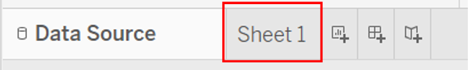

```{r setup, include=FALSE}
knitr::opts_chunk$set(echo = FALSE)
```

# 1. Introduction
Nowadays, data visualisation such as graphs and maps can be found anywhere. Data visualisation can help us to understand better what the information means and it will also make it easier to understand the trends, patterns, and outliers within large datasets. However, a poor data visualisation can be misleading or make it even harder to understand the information. 

This post will makeover the merchandise trade chart below, so that it can be more fruitful for the audience. The data visualisation will be created by using data provided by Department of Statistics, Singapore (DOS). The data are available under the sub-section of [Merchandise Trade by Region/Market](https://www.singstat.gov.sg/find-data/search-by-theme/trade-and-investment/merchandise-trade/latest-data).


# 2. Critique of Visualisation 
To explore different perspective and design more truthful and enlightening data visualisation, we will first observe the original visualisation. The critiques will be divided into two section, clarity and aesthetics.


## 2.1 Clarity
1. **The title of the graph does not match the visualisation.** The title leads us to expect that the graph will be showing merchandise trade data for period 2019 to 2020, meanwhile the x-axis label for Japan only shows year of 2020 and the period for the rest of the graph starts from 2019 and ends in 2021.
2. **The period of the data used is inconsistent.** According to the graph, it seems like it covers merchandise trade data from 2019 to 2021 for Hong Kong, Mainland China, Taiwan, US, and Malaysia. However, we can observe that for Japan, it only covers merchandise trade data in 2020.
3. **The title of X axis is confusing.** The axis title clearly mentions "Month of Period", but the x-axis label display years instead of months. 
4. **There is no lead-in or call-outs to provide context**.

## 2.2 Aesthetics
1. **It is difficult to see some data points in the chart**.The graph will be easier to understand if line graph were used. Area graph make some data points harder to read, since some of the data points are overlapped between import and export.
2. **There is no tick marks for both axis** even though this graph is a continuous scale. The non existence of the graph make it harder to read the data points.
3. **The choices of colors can be improved**. More contrast colors might able to make the graph easier to read. 
4. **The title does not align with the graphs**. The placing of the title is not in the center nor left-aligned. 

# 3. Alternative Design

The alternative graphical design proposed can be seen below:

 

The proposed design above will improve the original visualisation in terms of:

# Clarity:
1. Line graph is used for the visualisation and the label of x-axis is changed to month and year instead of only year. These two combination will make it easier to see the merchandise trade's trend for each country.

2. Export and Import is split into two different graph, which make it easier to compare import and export trend among the top six Singapore's merchandise trade partners.

3. Additional charts is added to paint a clearer picture of how the export and import values changed from 2019 to 2020 for each country. The scatter plot will also show the relationship between of export value and import value for each top trading partners.

4. The title match the content of the graph.

5. The period of the data used will be consistent for all countries.

# Aesthetics:
1. Major tick marks is added for both axis since it is continuous scale.Tick marks will make the graph easier to read.
2. The color of the charts were chosen to guarantee that most people who are colorblind can distinguish groups of data that are color coded
3. The title is now aligned with the position of the graph, the chart titles are all left aligned.


# 4. Step-by-Step Guide

## 4.1 Data Preparation

1.	Clean the raw data by selecting all countries’ merchandise trade data for the year 2019 to 2020. Copy the table from the raw dataset and paste it into the first row of the new created worksheet by using excel workbook. Clean import and export data are stored in two different worksheets.

import data:

 

Export data:


2. Create a new column in the clean data worksheets to store the country name.


3. Import the data into tableau and join import and export data by country, the steps are as follows:

* Open tableau and select microsoft excel under connect panel -> select the file type


* Drag the sheets that need to be imported to the workspace one by one


* Edit the relationship by typing country in both of the search bars


* Click **Country1** and **Country(T1-Clean(Export))** -> **close**


* Hide the unwanted column(s) that is not needed for the data preparation or analysis by clicking the small arrow beside the column name -> hide


* New worksheet is needed for the next step of data preparation.




4. Create a text table by placing country on the rows shelves and monthly import data in columns and then click text table from show me.


The text table are shown in the figure below.


  

5. Pivot the data from crosstab format to columnar format by viewing the data in tableau. 


Click **Export All** and save it as excel file.


6. Split the measure names into two columns (year and month) by using excel for both import and export data. 


7. To create a date value in excel, convert the month names into number. Create a new column called “Date” in excel according to the year and month in measure name. 


8. Repeat step 4 to 7 for merchandise export data. Merge columnar format import and export data into one excel file to make it easier when importing the data into tableau.


9. Import clean merchandise data into tableau and join both dataset by country and date (the step by step guide of importing the data can be seen in step 3). Select the merchandise trade data for top six trading countries that were mentioned in the original graph by using filter function in data source tab.


After clicking **add** in filters,click **Add** again in "edit data source filter" window. 


Select country -> **OK**. Select all the countries that we need for the analysis, by clicking the checkboxes in front of the country.


After the filter was applied, the top six merchandise trade data is ready to be used for the analysis.


## 4.2 Monthly Merchandise Trade Performance, 2019 -2020
This visualisation will be using monthly import and export data for each country.

1. Drag export and import data to Rows shelf and drag country into colour.


2. click the small arrow in **Year** inside the column shelf, select month that is highlighted in blue.


3. Right Click on X-axis to edit the date range.


4. Change the date range, title, and tick marks settings as per below.


5. Right Click on the X-axis -> **Format**, to edit the label's and tick marks' font and color. Since the background color is white, change the tick mark's color to black, so they will be visible. Custom the label format to **mmm yy**, and choose **up** for the alignment.


## 4.3 Net Importers and Net Exporters, 2019 - 2020

This graph is to show the relationship between import and export data.

1. Drag **Date** and **Export** to column shelf and drag **Import** to row shelf
2. Drag **Country** to Text and Detail, drag **Date** to Color


3. Hide the legend of the graph, by clicking the small arrow in the legend -> **Hide Card**


4. The steps to create the 45 degree line,  are as follow:

* Drag **Import** to columns shelf -> Click the small arrow -> **Dual Axis**


* Click **Sum(Import)** in the columns shelf and edit the components under marks shelf

* Remove **Country** (Text - SUM(Import)) from Marks shelf


* Click **Color** in SUM(Import) -> change the opacity to 0%


* Right click on the graph -> **Trend Lines** -> **Show Trend Lines** -> **SUM(Import)**


* Change the axis range to **Fixed** -> change **Fixed start** and **Fixed end**


* Make sure all these 5 axis have same range


* Change the format of the 45 degree line by double clicking the line -> **Format**

* Change the format of the trend line to dotted line


5. Hide the header for the top axis. Right click on the axis -> **Show Header**


6. Hide field labels for columns


7. Change the color of the graph by choosing **color** for **SUM(Export)** in Marks shelf -> select the data item -> choose the color


8. Change the title of the graph by double clicking the title -> Change the title -> **Apply** -> **OK**


9. Add the annotation by right clicking the graph -> **Annotate** -> **Area**


## 4.4 Yearly Merchandise Trade Comparison by Country, 2019-2020

The third graph is to find the percentage change of total merchandise trade for each country for the year 2019 to 2020.

1. Drag **Country** and **Date** to columns shelf -> Drag **Export** to rows shelf twice


2. Click the small arrow in one of the SUM(Export) -> **Dual Axis**


3. Change one of the Sum(Export) line graph to circle under Marks shelf. Do this for import graph too. Adjust the circle by clicking size.


4. To make the graph clearer, set a different color for different year for both import and export circle graph by dragging **Date** to color.


5. Percent difference was calculated for each country to see how the merchandise trade changes from 2019 to 2020. The steps to add percent difference are as follow:

* Drag **Export** to line graph SUM(Export) - Label


* Click the small white arrow in line graph SUM(Export) inside the **Marks Shelf** -> **Quick Table Calculation** -> **Percent Difference**


* Click the small white arrow again -> **Calculate Using** -> **Date**


6. Repeat step 1 to 5 to show the percent difference for import graph

## 4.5 Dashboard

Consolidate all the three worksheets into one dashboard.

1. To create a new dashboard, click the **New Dashboard Tab**


2. We can adjust the dashboard size, change **Fixed size** to **Automatic** is highly recommended


3. Drag the worksheets to the canvas, tick **Show dashboard title** if needed


4. Change the dashboard title by double clicking the title, same as changing the worksheet's title

5. The [final dashboard](https://public.tableau.com/app/profile/jovinka.hartanto3850/viz/Datavizmakeover1-Jovinka/Dashboard2) is ready

# 5.0 Major Obeservations

1. Among the top six Singapore's trading partners, the number of countries that has value of goods exported by Singapore exceeds the goods imported by them in 2020 is higher compare to 2019. In 2019, the value of exports exceed imports for Singapore's merchandise trade with Mainland China and Hong Kong. In comparison, in 2020 the value of exports also exceeds imports for the merchandise trade with US. The biggest export destination of Singapore's goods is Mainland China, followed by Hong Kong for both years, 2019 and 2020. However, Hong Kong has extremely high export value compare to its import value, which made Hong Kong the biggest contributor to Singapore's [net exports](https://www.investopedia.com/terms/n/netexports.asp) value.


2. The export value for United States increased by almost 20% in 2020, it started to increase at the end of 2019 and the peak is in April and July 2020. On the other hand, export value from Singapore to Malaysia decreased by 18.24% in 2020, it can be observed that the value started to decrease in early 2020, this might be due to a lack for demand in petroleum products because of the Covid-19 pandemic. In 2019, the main product that Singapore exported to Malaysia is refined petroleum and the petroleum products export from Singapore in Apr-Jul 2020 is around 55% lower than Apr-Jul 2019.

[Malaysia (MYS) and Singapore (SGP) Trade](https://oec.world/en/profile/bilateral-country/mys/partner/sgp)

[Bruce-Lockhart, 2020](https://www.ft.com/content/193e1ddb-9e61-413f-ab7d-df7a52f30413)


3. Import from Taiwan to Singapore increased by 13.36%, this is expected since Taiwan record historical high exports in 2020. This surged might be because of Taiwan's success in controlling the pandemic, it helped Taiwan get many orders diverted from other source and its semiconductor sector continued to dominate the global market with advanced manufacturing processes. 


[Focus Taiwan - CNA English News, 2021](https://focustaiwan.tw/business/202101080019)