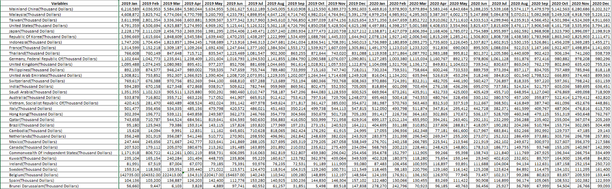
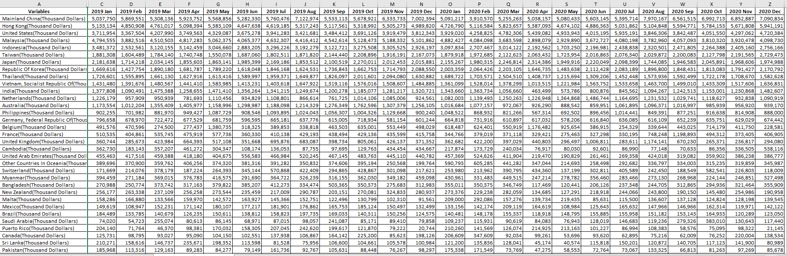

```{r setup, include=FALSE}
knitr::opts_chunk$set(echo = FALSE)
```

# 1. Introduction

# 2. Critique of Visualisation 
To explore different perspective and design more truthful and enlightening data visualisation, we will first observe the original visualisation of the data (Figure 1). The critiques will be divided into two section, clarity and aesthetics.


## 2.1 Clarity
1. **The title of the graph does not match the visualisation.** The title leads us to expect that the graph will be showing merchandise trade data for period 2019 to 2020, meanwhile the x-axis label for Japan only shows year of 2020 and the period for the rest of the graph starts from 2019 and ends in 2021.
2. **The period of the data used is inconsistent.** According to the graph, it seems like it covers merchandise trade data from 2019 to 2021 for Hong Kong, Mainland China, Taiwan, US, and Malaysia. However, we can observe that for Japan, it only covers merchandise trade data in 2020.
3. **The title of X axis is confusing.** The axis title clearly mentions "Month of Period", but the x-axis label display years instead of months. 

## 2.2 Aesthetics
1. The graph will be easier to understand if line graph were used.
2. Adding tick marks for both axis will be necessary since this graph is a continuous scale. The non existence of the graph make it harder to read the graph.


# 3. Alternative Design
The alternative graphical design proposed can be seen below:

The proposed design above will improve the original visualisation in terms of:

# 4. Step-by-Step Guide

1.	Clean the raw data by selecting all countries’ merchandise trade data for the year 2019 to 2020. Copy the table from the raw dataset and paste it into the first row of the new created worksheet by using excel workbook. Clean import and export data are stored in two different worksheets.
 



