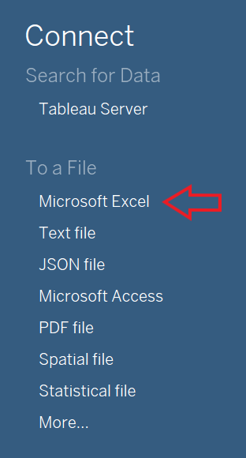
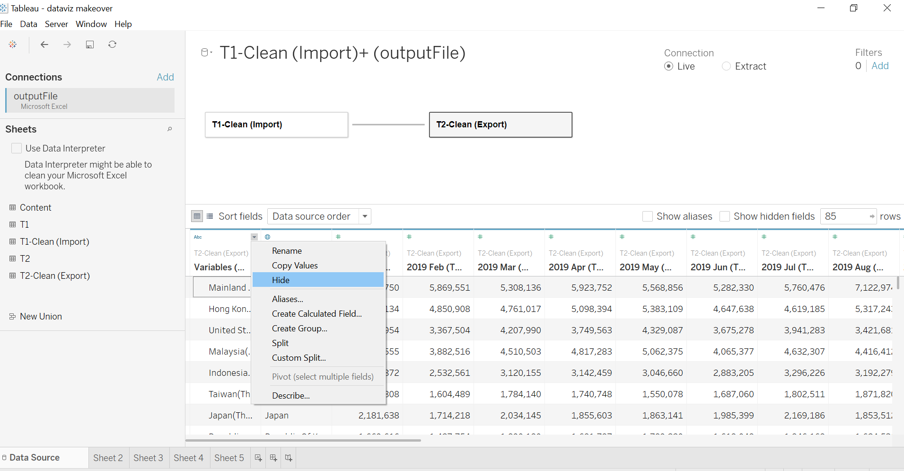
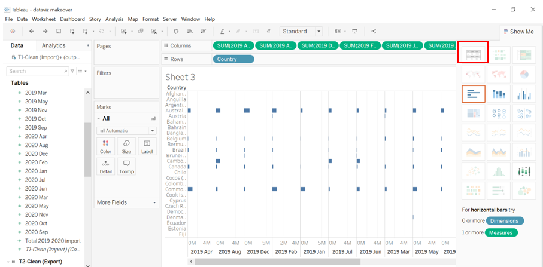
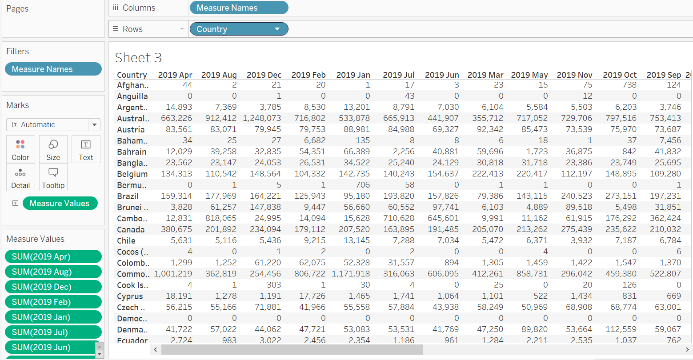

```{r setup, include=FALSE}
knitr::opts_chunk$set(echo = FALSE)
```

# 1. Introduction

# 2. Critique of Visualisation 
To explore different perspective and design more truthful and enlightening data visualisation, we will first observe the original visualisation of the data (Figure 1). The critiques will be divided into two section, clarity and aesthetics.


## 2.1 Clarity
1. **The title of the graph does not match the visualisation.** The title leads us to expect that the graph will be showing merchandise trade data for period 2019 to 2020, meanwhile the x-axis label for Japan only shows year of 2020 and the period for the rest of the graph starts from 2019 and ends in 2021.
2. **The period of the data used is inconsistent.** According to the graph, it seems like it covers merchandise trade data from 2019 to 2021 for Hong Kong, Mainland China, Taiwan, US, and Malaysia. However, we can observe that for Japan, it only covers merchandise trade data in 2020.
3. **The title of X axis is confusing.** The axis title clearly mentions "Month of Period", but the x-axis label display years instead of months. 

## 2.2 Aesthetics
1. The graph will be easier to understand if line graph were used.
2. Adding tick marks for both axis will be necessary since this graph is a continuous scale. The non existence of the graph make it harder to read the graph.


# 3. Alternative Design
The alternative graphical design proposed can be seen below:

The proposed design above will improve the original visualisation in terms of:

# 4. Step-by-Step Guide

1.	Clean the raw data by selecting all countries’ merchandise trade data for the year 2019 to 2020. Copy the table from the raw dataset and paste it into the first row of the new created worksheet by using excel workbook. Clean import and export data are stored in two different worksheets.

import data:

 
Export data:


2. Create a new column in the clean data worksheets to store the country name.


3.    Import the data into tableau and join import and export data by country, the steps are as follows:

* Open tableau and select microsoft excel under connect panel and select the file

* Drag the sheets that need to be imported to the workspace one by one

* Edit the relationship by typing country in both of the search bars

* Click "Country1" and Country(T1-Clean(Export)), and the click **close**

* Hide the unwanted column(s) that is not needed for the data preparation or analysis by clicking the small arrow beside the column name -> hide.

* Now that the dataset is ready to be used, we can click the new empty sheet and start our visualisation

4. Create a text table by placing country on the rows shelves and monthly import data in columns and then click text table from show me.



The text table are shown in the figure below.


  

5. Pivot the data from crosstab format to columnar format by viewing the data in tableau. Click “Export All” and save it as excel file.


6. Split the measure names into two columns (year and month) by using excel for both import and export data. 


7. To create a date value in excel, convert the month names into number. Create a new column called “Date” in excel according to the year and month in measure name. 


8. Repeat step 4 to 7 for merchandise export data. Merge import, export, and total merchandise trade data in columnar format into one excel file to make it easier for importing the data into tableau.


9. Import clean merchandise data into tableau and join both dataset by country and date (the step by step guide of importing the data can be seen in step 3).Select the merchandise trade data for top six trading countries that were mentioned in the original graph by using filter function in data source tab.


After clicking **add** in filters,click **Add** again in "edit data source filter" window. 


Select country -> **OK**. Select all the countries that we need for the analysis, by clicking the checkboxes in front of the country.


