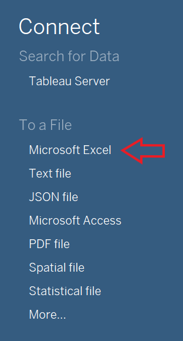
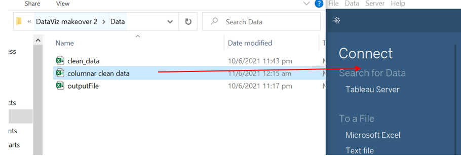

```{r setup, include=FALSE}
knitr::opts_chunk$set(echo = FALSE)
```

# 1. Introduction
Nowadays, data visualisation such as graphs and maps can be found anywhere. Data visualisation can help us to understand better what the information means and it will also make it easier to understand the trends, patterns, and outliers within large datasets. However, a poor data visualisation can be misleading or make it even harder to understand the information. 

This post will makeover the chart below, so that it can be more fruitful for the audience. The data visualisation will be created by using data provided by Department of Statistics, Singapore (DOS). The data are available under the sub-section of [Merchandise Trade by Region/Market](https://www.singstat.gov.sg/find-data/search-by-theme/trade-and-investment/merchandise-trade/latest-data).

# 2. Critique of Visualisation 
To explore different perspective and design more truthful and enlightening data visualisation, we will first observe the original visualisation. The critiques will be divided into two section, clarity and aesthetics.  


## 2.1 Clarity
1. The color opacity of the chart can be reduced, since some of the plots overlap each other. 
2. The label is not very informative, for example, it can state number of import, export, and total.
3. There is no gridlines in the chart to help the audience compare the import and export values 
4. There is not enough annotation or tooltip that can show the audience the import and export value
5. There is no explanation of what is the label in each bubble represent, it can caused misinterpretation

## 2.2 Aesthetics
1. The color opacity of the chart can be reduced, since some of the plots overlap each other.
2. A similar color is used to represent two different trading partners, Thailand and EU.
3. Using an acronym for European Union (EU) make the naming of the trading partners inconsistent, since the rest of the trading partners was written in long form. 

# 3. Alternative Design
# Clarity:

# Aesthetics:


# 4. Step-by-Step Guide

## 4.1 Data Preparation

1. Copy the table from the raw dataset and paste it into the first row of the new created worksheet by using excel workbook.

2. Remove the data that is outside the study period. The study period for this study is between January 2011 to December 2020 for both import and export data. Clean import and export data are stored in the same file, but two different worksheets.

3. Import clean dataset into tableau. There are few ways to import the dataset, two of them are:
* Click *Microsoft Excel* and select your file or

 

* Drag the desired data file to tableau data source

 

4.Drag new union to workspace 

 

5. A union window will pop out, drag both import and export clean data to union window -> *ok*

 

6. To change the monthly data to columnar format, select the import and export data from 2011 Jan to 2020 Dec by clicking 2011 Jan data -> Press *Shift* and click 2020 Dec data.
If you did it correctly, all the selected columns will turn blue.


7. Click the small arrow in 2020 Dec column -> *Pivot*


8. The result of the pivot is as shown below


9. Double click on the column name to rename it

10. Since the date data type is marked as string, change the data type to Date by clicking *abc* in the column's top left -> *Date*. Change *Pivot Field Values* data type to *number* instead of *string* 


11. Since the variables consist of to components, trading partners and unit, we will split variables into two separate columns by clicking the small arrow in the column name -> Split


12. The Variables column will be split into 2 columns, *Variables - split 1* and *Variables - split 1*. 


Rename it into *Trading Partners* and *Unit* by double clicking the column names and type the desired column name.

13. Hide the original Variables column since we do not need it anymore


14. Do quality assurance (QA) to check any data discrepancies, especially for the split columns by dragging unit to the row pane in workspace canvas


15. Unit supposed to be either *Million* or *Thousand*, however it can be seen from the table below that there are other components that is not suppose to be in unit.


16. We can observe further by dragging *Trading Partners* into row shelves and *Unit* into filter -> untick *Million* and *Thousand* to see the which countries are these units belong to 


17. Create another column or variable called "Trading_Partners_Cleaned" to store the modified partners' name by using calculated field


18. Create another calculated field called *Unit_Cleaned*, the formula is as follow


19. Separate the merchandise trade values into Export and Import variable by using calculated field and since merchandise trade values are in either Million or Thousand dollars, the value will be multiplied by 1,000 or 1,000,000 based on the unit. The formula for export and import value are as follow:


20. It was observed that the trading partners are not only countries, it also consist of continents and total export and import. Since the focus in this study is to compare merchandise trade data between countries and union, we will create a calculated field that is only consist of countries and union.


21. Create another calculated field as *Total Export & Import*


Now the data preparation is done, merchandise trade data is ready to be used for the analysis.

## Top 10 Trading Partners

1. In a clean worksheet:

* Drag *Export* to columns shelves,*Import* to rows shelves, *Country* to detail in marks shelves to create the scatter plot
* Drag *Country* to Text, to show Country Name in the plot
* Drag *Total Export & Import* to tooltip, to give more information for each plot


2.Drag *Country* to filters shelves


3. Change the filter[Country] setting 
* General-> Untick null


* Top -> By Field -> Change *Country* to *Total Export & Import* -> Apply -> Ok


4. Drag *Date* to filters shelves -> Double click on *# Years* 


Click All -> Apply -> Ok


5. Show both Country and Year(Date) filter by clicking the small white arrow -> Show Filter 


6. The selection default of this Filter[Country] is *Multiple Values (list)*.


 But, it will look better if we change it to *Multiple Values (dropdown)* . Click small black arrow in the selection beside the text *Country* -> Multiple Values (dropdown)
 


7. Repeat steps 5 and 6 for Filter[Year of Date], but instead of choosing Multiple Values (dropdown), choose Single Value (dropdown)

8. Remove *(All)* from year selection. Click small black arrow beside the text *Year(Date)* -> Customize -> Show "All" Value


9. To change the chart title, double click on the title and change the title. However, in this case we want to insert YEAR(Date) selection variable to the title, the steps to add the selection variable are as follow:

1. Remove *<Sheet Name>*, and type the text.
2. Click *Insert* -> YEAR(Date)


10. Change the plot from *Automatic* -> *Circle*


11. Adjust the size, by selecting the icon below 


12. For visualization purposes, we will create a new boolean calculated field to separate the plot into two groups with two different colour. The first group is if sum of Import data higher than sum of Export data for the selected year. The second group is their sum of Export data higher than sum of Import data.

The calculated field formula is as follow:


13. Drag *import>export* variable to colour, and now we can see two different groups. Orange plots are those countries with sum of import higher than export for the selected year, year 2019 was selected for the example below.


14. Adjust the color by clicking colour in marks shelves.


## Import Export Trend

This line chart is created to show the monthly import export trend for the selected year and selected country. The chart will be inserted in the *Top 10 Trading Partners* plot's tooltip.

1. Create a new worksheet by clicking the icon below


2. Drag *Country* and *Date* variable to columns shelves, *Import* and *Export* to rows shelves


3. Click the small arrow in *YEAR(Date)* variable in columns pane -> Select month


4. We will use dual lines graph for this chart.


Once you click dual lines graph, country variable will move to rows shelves, drag country back to columns shelves. 

5. To make the colour of the axis title match with the color of the chart, right click on the axis -> Format


6. Click the small arrow beside *Font* -> Choose the colour


7. Repeat step 5 and 6 for export axis

